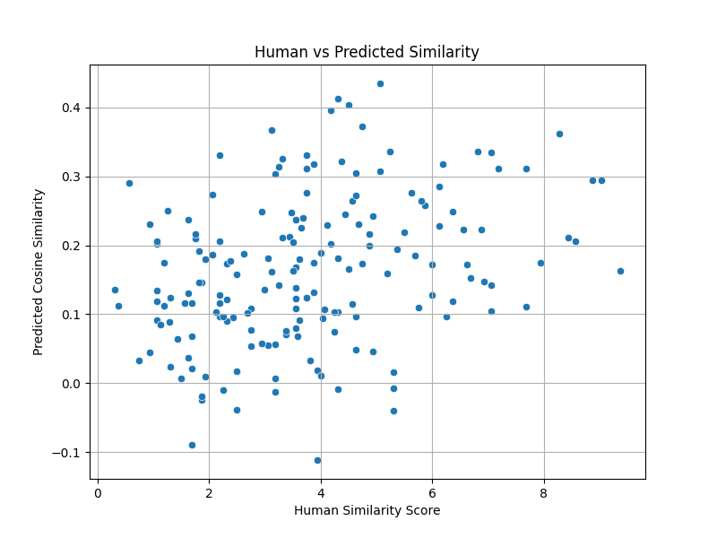
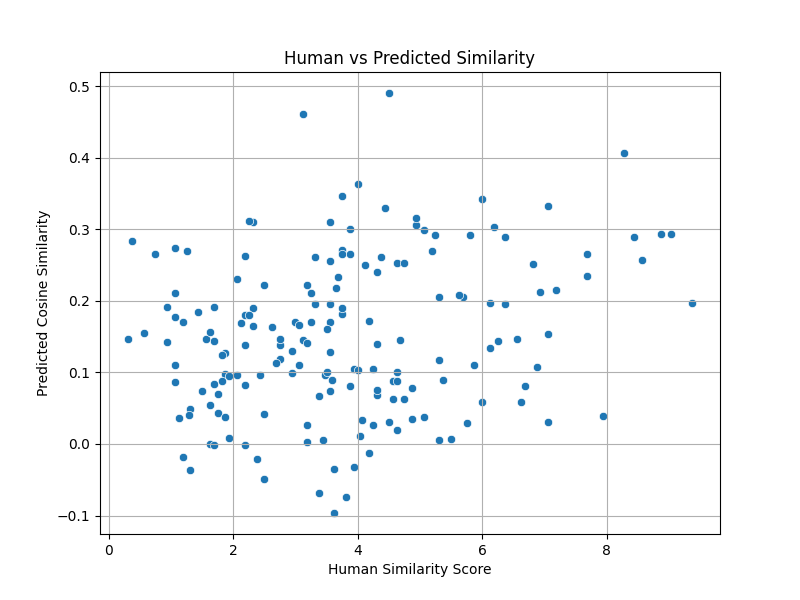
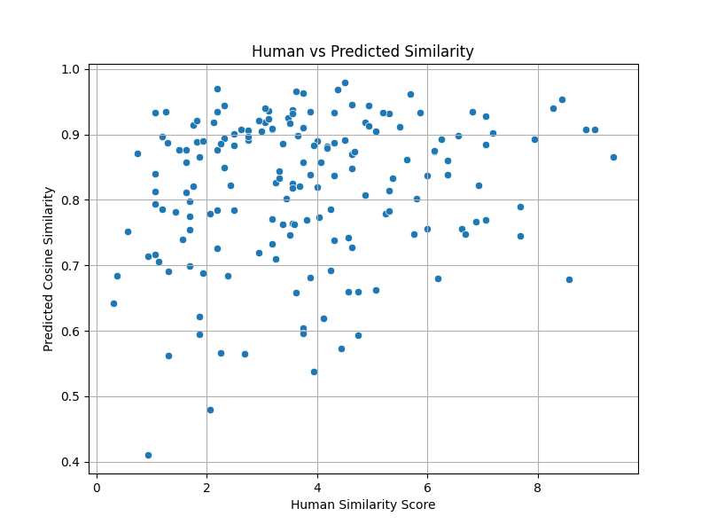

# Word Embeddings Report

## 1. Introduction
Word embeddings are a crucial part of natural language processing, allowing words to be represented as dense vectors in a continuous space. In this report, we explore three different word embedding methods: Singular Value Decomposition (SVD), Continuous Bag of Words (CBOW), and Skip-Gram. We train these models using the Brown Corpus and evaluate their effectiveness using the WordSim-353 dataset.

## 2. Training Word Vectors
For each of the algorithms, embeddings were trained using the Brown Corpus from NLTK. The learned embeddings were stored as `.pt` files.

### 2.1 SVD 
Implemented a word embedding model using the following steps:
1. Built a Co-occurrence Matrix.
2. Applied Singular Value Decomposition (SVD) to reduce the dimensionality and extract meaningful word vectors.

### 2.2 CBOW Algorithm 
Implemented a word2vec model using the Continuous Bag of Words (CBOW) approach with Negative Sampling. The model was trained using the Brown Corpus, and word vectors were saved.

### 2.3 Skip-Gram Algorithm 
Implemented a word2vec model using the Skip-Gram approach with Negative Sampling. Similar to CBOW, the model was trained on the Brown Corpus, and the learned word vectors were stored.

## 3. Word Similarity 
To evaluate the trained word embeddings, we used the WordSim-353 dataset, which contains pairs of words with human-assigned similarity scores ranging from 0 to 10.

For each word pair:
1. Computed the cosine similarity of their embeddings.
2. Skipped word pairs where either word was not in the training corpus.
3. Calculated Spearman’s Rank Correlation between the computed cosine similarities and the human-assigned similarity scores.

## 4. Results
The following results were obtained when evaluating the trained embeddings using the WordSim-353 dataset:

```
python3 wordsim.py cbow.pt
Loading embeddings from cbow.pt...
Loading WordSim-353 dataset...
Spearman’s Rank Correlation: 0.1935

python3 wordsim.py svd.pt
Loading embeddings from svd.pt...
Loading WordSim-353 dataset...
Spearman’s Rank Correlation: 0.1466

python3 wordsim.py skipgram.pt
Loading embeddings from skipgram.pt...
Loading WordSim-353 dataset...
Computing word similarities...
Spearman’s Rank Correlation: 0.3379
```

## 5. Analysis 
### 5.1 Comparison of Results
| Model | Spearman’s Rank Correlation |
|--------|----------------------------|
| CBOW   | 0.1935                      |
| SVD    | 0.1466                      |
| Skip-Gram | 0.3379                      |

1. **Skip-Gram achieved the highest correlation** (0.3379), indicating better alignment with human-assigned similarity scores.
2. **CBOW performed moderately** (0.1935), but lower than Skip-Gram.
3. **SVD performed the worst** (0.1466), suggesting that matrix decomposition methods might be less effective compared to predictive models like word2vec.

### 5.2 Benefits and Limitations
#### SVD:
- **Benefits:** Provides a globally optimized embedding based on the entire corpus.
- **Limitations:** Computationally expensive and less effective in capturing contextual relationships.

#### CBOW:
- **Benefits:** Faster training, useful for frequent words, and efficient.
- **Limitations:** Performs poorly on rare words and lacks precise word representation.

#### Skip-Gram:
- **Benefits:** Better representation of rare words and captures finer semantic relationships.
- **Limitations:** Slower training compared to CBOW.

### 5.3 Scatter Plot Analysis

To better visualize the relationship between predicted word similarities (from each embedding model) and human-assigned similarity scores, we generated scatter plots using the WordSim-353 evaluation data. Each point represents a word pair, where the x-axis is the human similarity score, and the y-axis is the cosine similarity predicted by the model.

#### Scatter Plots





## 6. Submission Format
The following files have been submitted in a zip file:

1. **Source codes**
   - `svd.py`: Trains embeddings using SVD and saves vectors.
   - `skipgram.py`: Trains embeddings using Skip-Gram and saves vectors.
   - `cbow.py`: Trains embeddings using CBOW and saves vectors.

2. **Word similarity computation**
   - `wordsim.py <embedding_path>.pt`: Computes cosine similarities and outputs Spearman Rank Correlation.

3. **Learned word embeddings**
   - `svd.pt`: Word vectors trained using SVD.
   - `skipgram.pt`: Word vectors trained using Skip-Gram.
   - `cbow.pt`: Word vectors trained using CBOW.

4. **Report** (this document) containing analysis, hyperparameters, and graphs.
5. **CSV file** with similarity results.
6. **README** file explaining execution steps.

## 7. Conclusion
This report analyzed three different word embedding techniques. The results suggest that **Skip-Gram is the most effective** in capturing word similarity as measured by Spearman’s Rank Correlation. Future work could involve training on a larger corpus or experimenting with different hyperparameters to further improve performance.

